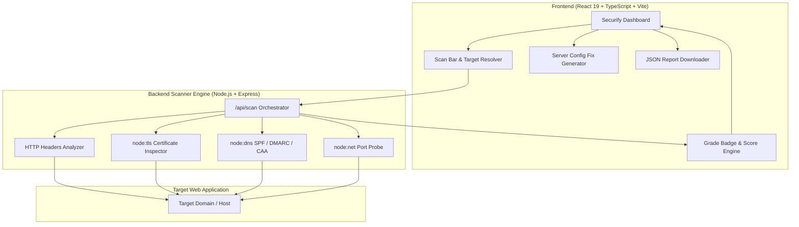

<div align="center">

# 🛡️ Securify

### The Modern DevSecOps & Web Security Auditor

[](https://opensource.org/licenses/MIT)
[](https://www.typescriptlang.org/)
[](https://react.dev/)
[](https://nodejs.org/)
[](https://vitejs.dev/)
[](https://tailwindcss.com/)
[](https://github.com/Hamidooh/securify/actions)
[](CONTRIBUTING.md)

<p align="center">
  A high-speed, comprehensive web application security analysis suite. Inspect HTTP security headers, analyze live SSL/TLS encryption certificates, test DNS email spoofing defenses (SPF & DMARC), probe sensitive server ports, and generate automated server hardening configurations.
</p>

</div>

---

## 🌟 Key Features

- 🔒 **HTTP Security Headers Auditor**: Evaluates `Content-Security-Policy` (CSP), `Strict-Transport-Security` (HSTS), `X-Frame-Options`, `X-Content-Type-Options`, `Referrer-Policy`, and `Permissions-Policy`. Computes weighted scores and assigns letter grades from **A+ to F**.
- 📜 **SSL / TLS Certificate Analyzer**: Direct socket TLS handshake inspection reporting certificate validity, days-to-expiration countdowns, Subject Alternative Names (SANs), cipher suites, protocol versions (TLSv1.2, TLSv1.3), and key bit lengths.
- 📧 **DNS & Email Spoofing Defense Diagnostics**: Validates SPF (`v=spf1`) and DMARC (`v=DMARC1`) records to identify phishing and email domain spoofing risks, plus CAA and IP records.
- 📡 **Port & Service Exposure Inspector**: Probes common web and sensitive database ports (80, 443, 8080, 21, 22, MySQL 3306, Postgres 5432, Redis 6379, MongoDB 27017) to prevent inadvertent public exposure.
- 🛠️ **Automated Remediation Generator**: Instantly generates ready-to-deploy hardening snippets for **Nginx**, **Apache** (`.htaccess`), **Caddy**, **Vercel** (`vercel.json`), and **Express.js** (`helmet`).
- 📋 **OWASP Top 10 Security Checklist**: Interactive audit checklist mapping your application against the OWASP Top 10 (Broken Access Control, Cryptographic Failures, Injection, SSRF, etc.).
- 📥 **Exportable Security Reports**: Download comprehensive JSON audit results with timestamped telemetry.
- 🎨 **Developer-First Cyber UI**: Sleek dark terminal aesthetic with glowing grade badges, responsive layouts, and audit history caching.

---

## 🏛️ Architecture Overview



---

## 🚀 Quick Start

### Prerequisites
- **Node.js** >= 18.0.0 (Node 20+ or 22+ recommended)
- **npm** >= 9.0.0

### Installation

1. **Clone the repository**:
   ```bash
   git clone https://github.com/Hamidooh/securify.git
   cd securify
   ```

2. **Install dependencies**:
   ```bash
   npm install
   ```

3. **Start in development mode**:
   ```bash
   npm run dev
   ```

4. Open your browser:
   - **Frontend UI**: [http://localhost:5174](http://localhost:5174)
   - **Scanner Engine**: [http://localhost:3002](http://localhost:3002)

---

## 📦 Project Scripts

| Command | Description |
| :--- | :--- |
| `npm run dev` | Runs both the Vite client (`:5174`) and Scanner engine (`:3002`) concurrently |
| `npm run dev:client` | Starts only the Vite frontend development server |
| `npm run dev:server` | Starts only the Express security scanner backend |
| `npm run build` | Runs TypeScript compilation (`tsc`) and bundles with Vite |
| `npm test` | Runs the automated Vitest unit test suite |
| `npm run preview` | Previews the production bundle locally |

---

## 📊 Security Grading Criteria

| Grade | Score Range | Description |
| :--- | :--- | :--- |
| **A+** | 90 - 100 | Exceptional security posture. All core headers (CSP, HSTS, X-Frame, Nosniff) active with valid TLS. |
| **A** | 80 - 89 | Strong security headers configured with minor recommendations. |
| **B** | 70 - 79 | Good configuration, but missing defense-in-depth headers (e.g. Permissions-Policy, Referrer-Policy). |
| **C** | 60 - 69 | Moderate gaps; missing either CSP or HSTS. |
| **D** | 45 - 59 | Poor security posture; multiple high-impact headers missing. |
| **F** | 0 - 44 | Severe vulnerability exposure; missing HTTPS/TLS or critical database ports exposed. |

---

## 🧪 Testing

Securify includes automated unit test suites covering score calculation, grade badge assignments, remediation generation across 5 server types, and security header checklists:

```bash
npm test
```

---

## 🤝 Contributing

We welcome community contributions! Please review [CONTRIBUTING.md](CONTRIBUTING.md) to get started.

---

## 📄 License

This project is licensed under the [MIT License](LICENSE).

Developed with ❤️ by **Hamidooh** ([@Hamidooh](https://github.com/Hamidooh)).
