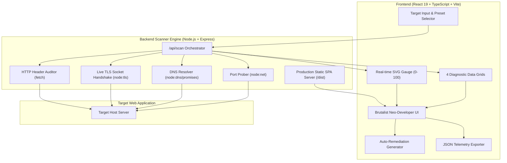

<div align="center">

# 🛡️ Securify

### The Modern DevSecOps & Web Security Auditor

[](https://securify-wyvc.onrender.com)
[](https://opensource.org/licenses/MIT)
[](https://www.typescriptlang.org/)
[](https://react.dev/)
[](https://nodejs.org/)
[](Dockerfile)
[](https://github.com/Hamidooh/securify/actions)

<p align="center">
  <strong>An enterprise-grade, high-speed security intelligence engine and interactive developer dashboard.</strong><br>
  Analyze live SSL/TLS certificate chains, grade HTTP security headers, diagnose DNS email spoofing defenses (SPF/DMARC), probe exposed database ports, and generate automated server hardening configurations in seconds.
</p>

<p align="center">
  <a href="https://securify-wyvc.onrender.com"><strong> Launch Live Application</strong></a> •
  <a href="#-architecture-overview"><strong> Architecture</strong></a> •
  <a href="#-rest-api-reference"><strong>📡 REST API</strong></a> •
  <a href="#-quick-start"><strong> Quick Start</strong></a> •
  <a href="#-docker-deployment"><strong> Docker</strong></a> •
  <a href="#-contributing"><strong> Contributing</strong></a>
</p>

</div>

---

##  Terminal Audit Preview

```bash
audit@securify:~$ scan github.com

[✓] TLS Handshake ............ 200 OK (TLSv1.3, DigiCert SHA2 Secure Server CA, 55 days left)
[✓] Security Headers ......... Grade A+ (HSTS: active, CSP: active, X-Frame: DENY, nosniff: OK)
[!] DNS Email Defenses ....... Gaps Detected (SPF: apex delegated, DMARC: apex delegated)
[✓] Port Exposure Probes ..... 3 Open (80 HTTP, 443 HTTPS, 22 SSH | Database Ports: SECURE)

> CONSOLIDATED SCORE: 80 / 100 [GRADE A] | SCAN TIME: 1679ms
```

---

##  Core Modules & Capabilities

### 1.  HTTP Security Headers Auditor
Inspects, parses, and evaluates critical defensive HTTP response headers against OWASP guidelines:
* **`Content-Security-Policy` (CSP)**: Validates script execution origins and frame-ancestors to prevent Cross-Site Scripting (XSS) and data injection.
* **`Strict-Transport-Security` (HSTS)**: Evaluates enforcement duration (`max-age`), subdomain coverage, and HSTS preload eligibility.
* **`X-Frame-Options`**: Verifies anti-clickjacking directives (`DENY`, `SAMEORIGIN`).
* **`X-Content-Type-Options`**: Checks MIME-type sniffing suppression (`nosniff`).
* **`Referrer-Policy`**: Flags leakage of sensitive URL tokens across cross-origin requests.
* **`Permissions-Policy`**: Audits restriction of invasive browser APIs (camera, microphone, geolocation).
* **Information Disclosure Detection**: Identifies server leakages via `Server` and `X-Powered-By` headers.

### 2.  Live SSL / TLS Certificate Inspector
Direct raw socket TLS handshake (`node:tls`) inspection without browser caching:
* **Validity Timeline**: Exact validity window, issue date, expiration countdown, and renewal urgency flags.
* **Cryptographic Strength**: Protocol version (`TLSv1.2`, `TLSv1.3`), cipher suite (`AES-256-GCM`, `CHACHA20-POLY1305`), and key bit length.
* **Certificate Authority (CA)**: Full issuer organization validation and verification status.
* **Subject Alternative Names (SANs)**: Comprehensive extraction of all multi-domain hostnames covered.
* **Fingerprint Telemetry**: Complete SHA-256 fingerprint and serial number verification.

### 3.  DNS & Phishing Defense Engine
Performs live DNS record lookups (`node:dns/promises`) to assess email security:
* **SPF (`v=spf1`)**: Audits authorized outbound mail server policies to prevent domain forgery.
* **DMARC (`v=DMARC1`)**: Validates domain-level enforcement policies (`p=reject`, `p=quarantine`, `p=none`) and abuse telemetry addresses (`rua`).
* **CAA Records**: Ensures Certification Authority Authorization restricts unauthorized certificate issuance.
* **Routing Telemetry**: Resolves dual-stack IPv4 (`A`) and IPv6 (`AAAA`) addresses and Mail Exchanger (`MX`) priorities.

### 4.  Network Port & Service Exposure Matrix
Rapid multi-threaded socket probing (`node:net`) across sensitive service ports:
* **Standard Web**: `80` (HTTP), `443` (HTTPS), `8080` (HTTP-Alt), `8443` (HTTPS-Alt).
* **Remote Management**: `22` (SSH), `21` (FTP).
* **Internal Databases (Critical Risks)**: `3306` (MySQL), `5432` (PostgreSQL), `6379` (Redis), `27017` (MongoDB).

### 5.  Automated Hardening Config Generator
Converts detected vulnerabilities into instant, copyable production configurations:
* **Nginx** (`nginx.conf` or virtual host)
* **Apache** (`.htaccess` with `mod_headers`)
* **Caddy** (`Caddyfile`)
* **Vercel** (`vercel.json`)
* **Express.js** (`helmet` middleware configuration)

### 6.  OWASP Top 10 Compliance Checklist
Interactive audit workflow tracking controls across **A01:2021 Broken Access Control** through **A10:2021 Server-Side Request Forgery (SSRF)**.

---

## 🏛️ Architecture Overview



---

##  Security Grading Criteria

| Grade | Score Range | Health Status | Primary Criteria |
| :---: | :---: | :---: | :--- |
| **A+** | 90 – 100 | **Exceptional** | Strict CSP, HSTS preloaded, X-Frame DENY, nosniff, TLS 1.3, SPF & DMARC enforced. |
| **A** | 80 – 89 | **Hardened** | Core security headers present with valid SSL certificate; minor non-critical gaps. |
| **B** | 70 – 79 | **Adequate** | Functional encryption, but missing defense-in-depth headers (Permissions-Policy, Referrer-Policy). |
| **C** | 60 – 69 | **Moderate Risk** | Missing either CSP or HSTS; susceptible to clickjacking or SSL stripping. |
| **D** | 45 – 59 | **High Risk** | Multiple critical headers absent; weak cryptographic configuration. |
| **F** | 0 – 44 | **Critical Exposure** | Inactive TLS/HTTPS, expired certificates, or exposed database ports (MySQL/Redis/Mongo). |

---

## 📡 REST API Reference

Securify exposes a headless REST API that can be consumed directly by CLI scripts or CI/CD pipelines.

### 1. Perform Security Scan
```http
POST /api/scan
Content-Type: application/json

{
  "target": "github.com"
}
```

#### Sample Response:
```json
{
  "target": "github.com",
  "scannedUrl": "https://github.com",
  "timestamp": "2026-10-06T12:18:36.000Z",
  "durationMs": 1679,
  "summary": {
    "overallScore": 80,
    "overallGrade": "A",
    "headersScore": 90,
    "headersGrade": "A+",
    "tlsStatus": "Valid",
    "exposedPortsCount": 3,
    "emailSecurityOk": false
  },
  "headers": {
    "score": 90,
    "grade": "A+",
    "findings": [
      {
        "header": "Strict-Transport-Security",
        "status": "pass",
        "impact": "High",
        "value": "max-age=31536000; includeSubDomains; preload"
      }
    ]
  },
  "ssl": {
    "success": true,
    "daysRemaining": 55,
    "protocol": "TLSv1.3",
    "cipher": "TLS_AES_256_GCM_SHA384"
  },
  "dns": {
    "hasSpf": false,
    "hasDmarc": false
  },
  "ports": [
    { "port": 443, "name": "HTTPS", "isOpen": true, "risk": "Low" },
    { "port": 3306, "name": "MySQL", "isOpen": false, "risk": "Critical" }
  ]
}
```

### 2. Service Health Check
```http
GET /api/health
```
```json
{
  "status": "ok",
  "service": "Securify Security Scanner Engine",
  "version": "1.0.0",
  "uptime": 318.4
}
```

---

##  Quick Start (Local Development)

### Prerequisites
* **Node.js** >= 18.0.0 (Node 20+ or 22+ recommended)
* **npm** >= 9.0.0

```bash
# 1. Clone the repository
git clone https://github.com/Hamidooh/securify.git
cd securify

# 2. Install dependencies
npm install

# 3. Launch development environment (Frontend on :5174, Scanner Engine on :3002)
npm run dev
```

Open **[http://localhost:5174](http://localhost:5174)** in your browser.

---

##  Docker Deployment

Securify includes a lightweight, multi-stage production Dockerfile (`node:20-alpine`):

```bash
# 1. Build the Docker image
docker build -t securify:latest .

# 2. Run container on port 3002
docker run -d -p 3002:3002 --name securify-app securify:latest

# 3. Access the dashboard
# Open http://localhost:3002 in your browser
```

---

##  Project Scripts

| Command | Description |
| :--- | :--- |
| `npm run dev` | Runs both Vite client (`:5174`) and Scanner engine (`:3002`) concurrently with hot-reload |
| `npm run dev:client` | Runs only the Vite frontend development server |
| `npm run dev:server` | Runs only the Express scanner backend engine |
| `npm run build` | Compiles TypeScript (`tsc`) and generates optimized production assets |
| `npm start` | Launches the production Express server (serves compiled static SPA + API) |
| `npm test` | Runs the automated Vitest unit test suite |
| `npm run preview` | Previews the production bundle locally |

---

##  Modular System Architecture

Securify is architectured as a decoupled, high-performance security auditing suite:

* ** Presentation Tier**: Interactive developer dashboard powered by React 19, TypeScript, and Tailwind CSS. Features real-time SVG grading gauge telemetry, tabbed diagnostic grids, and copy-ready automated server remediation generators.
* ** Security Engine Core**: High-speed Node.js backend executing asynchronous network probes—including low-level socket TLS handshake validation, recursive DNS SPF/DMARC resolution, and concurrent non-blocking port diagnostics.
* ** Headless REST Gateway**: Enterprise-ready JSON endpoints (`/api/scan`, `/api/health`) enabling seamless integration into automated DevSecOps pipelines and CI/CD security gating.
* ** Containerization & Deployment**: Lightweight multi-stage Docker containerization ready for immediate deployment across Render, AWS ECS, Fly.io, or on-premise infrastructure.

---

##  Roadmap

- [x] Live HTTP Security Headers auditor & grading algorithm
- [x] Socket-level SSL/TLS certificate inspector with expiration countdown
- [x] DNS email spoofing validator (SPF / DMARC verification)
- [x] Multi-threaded port prober with database exposure alerts
- [x] Supabase / Vercel Brutalist Neo-Developer UI architecture
- [x] Automated Nginx, Apache, Caddy, Vercel, and Express hardening generator
- [x] Interactive OWASP Top 10 compliance checklist
- [x] Production Docker container & Render live deployment
- [ ] Automated PDF Security Audit Report exporter
- [ ] Subdomain asset discovery and certificate transparency logging
- [ ] GitHub Action bot to run Securify automated PR security checks

---

##  Contributing

Contributions make the open-source community an incredible place to learn, inspire, and create. Any contributions you make are **greatly appreciated**.

1. Fork the Project (`https://github.com/Hamidooh/securify/fork`)
2. Create your Feature Branch (`git checkout -b feat/AmazingFeature`)
3. Commit your Changes (`git commit -m 'feat: add AmazingFeature'`)
4. Push to the Branch (`git push origin feat/AmazingFeature`)
5. Open a Pull Request

Please review [CONTRIBUTING.md](CONTRIBUTING.md) and [SECURITY.md](SECURITY.md) for detailed guidelines.

---

## 📄 License & Attribution Notice

Distributed under the **MIT License**. See [`LICENSE`](LICENSE) for complete terms.

> **Notice on Fair Use & Anti-Plagiarism**:
> Securify is an original open-source software project authored and maintained by **[@Hamidooh](https://github.com/Hamidooh)**.
> While the MIT License permits free usage, modification, and distribution, any reproduction, redistribution, or derivation of this software **strictly requires the preservation of the original copyright notice and author attribution**. Direct scraping, uncredited mirror re-uploading, or deceptive duplication without proper attribution is prohibited.

---

<div align="center">
  Developed with  by <strong><a href="https://github.com/Hamidooh">Hamidooh</a></strong>
  <br>
  <sub>If you find Securify useful, please consider giving it a ⭐ on GitHub!</sub>
</div>
